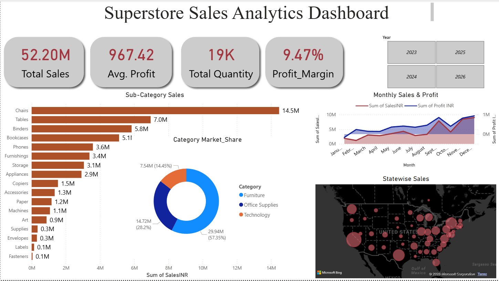

# 📊 Interactive Sales Analytics Dashboard | Power BI

## Overview

This project showcases an end-to-end Business Intelligence solution built using Power BI. The dashboard transforms raw sales data into interactive visual insights by performing data cleaning, data modeling, DAX calculations, and dashboard design.

---

## Dashboard Preview

>## Dashboard Preview

---

## Objectives

- Analyze overall sales performance
- Track profit trends
- Monitor category-wise performance
- Visualize geographical sales distribution
- Enable interactive business analysis using slicers

---

## Tools & Technologies

- Power BI
- Power Query
- DAX
- Microsoft Excel

---

## Data Preparation

The dataset was cleaned and transformed using Power Query.

Data preparation included:

- Data type correction
- Removing inconsistencies
- Handling missing values
- Data transformation
- Preparing tables for analysis

---

## Data Modeling

- Built relationships between tables
- Optimized model for reporting
- Created reusable DAX measures
- Implemented dynamic filtering

---

## KPIs

- Total Sales
- Average Profit
- Total Quantity
- Profit Margin

---

## Dashboard Features

✔ Interactive KPI Cards

✔ Year Slicer

✔ Cross Filtering

✔ Dynamic Visuals

✔ Category Market Share

✔ Monthly Sales & Profit Trend

✔ State-wise Sales Analysis

✔ Sub-category Sales Analysis

---

## Dashboard Insights

### Sales Performance

- Total Sales reached **52.20M**

### Profitability

- Profit Margin of **9.47%**

### Product Analysis

- Chairs generated the highest revenue among all sub-categories.

### Geographic Analysis

- Sales distribution can be explored state-wise using map visualization.

---

## Business Value

This dashboard helps stakeholders to:

- Monitor business performance
- Compare yearly sales
- Identify top-performing categories
- Analyze regional sales
- Make data-driven decisions

---

## Future Improvements

- Drill-through Pages
- Dynamic Top N Analysis
- YoY Growth
- MoM Growth
- Customer Segmentation
- Forecasting
- Bookmarks
- Tooltip Pages

---

## Author

Ayush Kumar
